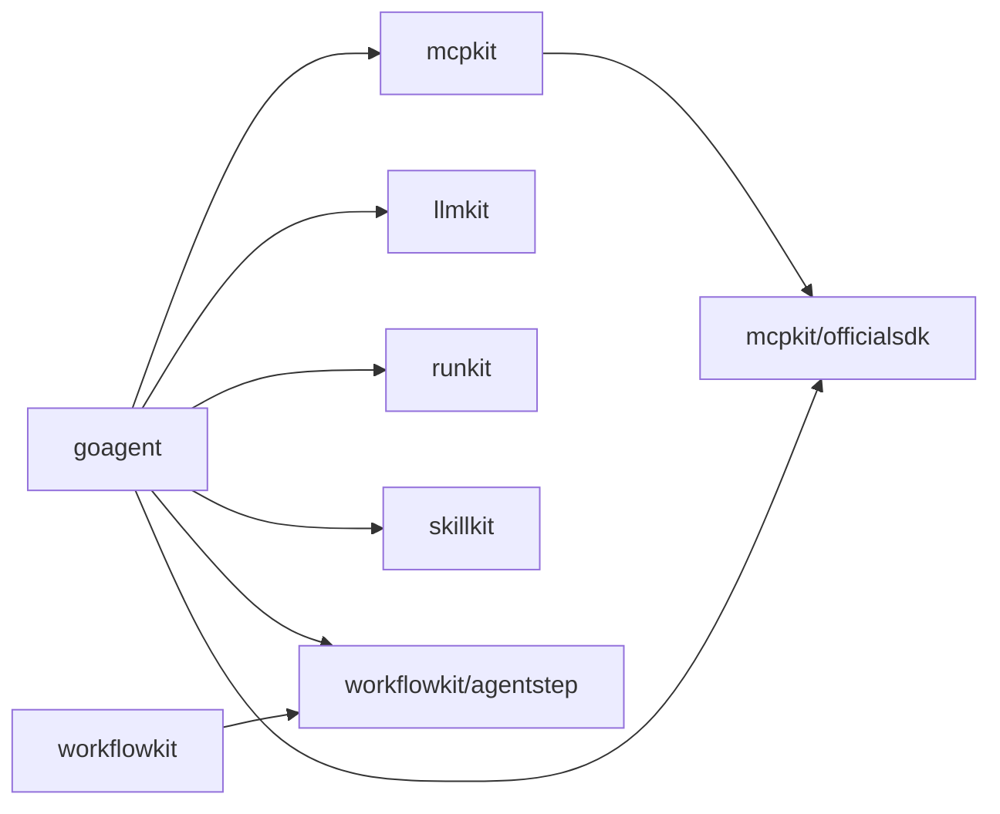

# GoAgents v0.1.0 多模块发布就绪设计

**日期：** 2026-07-16

## 1. 目标

在不创建 tag、不推送远端的前提下，把当前 MVP checkout 收敛为一个可审查的单仓多模块
`v0.1.0` 候选：模块路径、内部版本、tag 前缀、发布顺序和验证边界必须一致，且 `go.work`
不能掩盖错误的发布元数据。

## 2. 当前事实

- 仓库明确声明为 workspace monorepo，根目录没有 `go.mod`，共有 17 个 Go module。
- 其中 12 个是拟发布的库模块，5 个是只用于组合或验收的示例模块。
- 迁移前，示例模块已经使用 `github.com/eruca/goagents/...`，库模块仍使用
  `github.com/eruca/goagent`、`github.com/eruca/runkit` 等独立仓路径。
- 当前 Git checkout 没有 remote，也没有 tag；公开 GitHub URL 暂未提供可验证的模块仓库。
- 多个拟发布模块仍依赖 `v0.0.0` 或旧伪版本，并用相对 `replace` 连接本地模块。
- 仓库没有根许可证文件，因此不能把“技术候选已就绪”表述为“可以公开发布”。

## 3. 决策

### 3.1 单仓是唯一发布事实源

沿用现有 `docs/modules.md` 的单仓设计，未来仓库位置固定为：

```text
github.com/eruca/goagents
```

所有拟发布模块统一迁到该前缀，例如：

```text
github.com/eruca/goagents/goagent
github.com/eruca/goagents/workflowkit
github.com/eruca/goagents/workflowkit/agentstep
```

这是首个公开 tag 前的路径修正。若保留旧路径，Go 会把它们解析为多个独立 GitHub 仓库，
单仓中的子目录 tag 无法满足这些导入路径。

### 3.2 发布集合

拟发布 12 个模块：

- `goagent`
- `artifactkit`
- `contextkit`
- `evalkit`
- `ocrs`
- `workflowkit`
- `llmkit`
- `mcpkit`
- `runkit`
- `skillkit`
- `workflowkit/agentstep`
- `mcpkit/officialsdk`

仅验证、不创建 tag 的 5 个模块：

- `examples/evalkit-goagent-regression`
- `examples/host-api`
- `examples/host-runtime`
- `workflowkit/examples/agent-approval`
- `workflowkit/examples/ocr-review`

### 3.3 内部依赖版本

所有模块对拟发布内部模块的 `require` 统一为 `v0.1.0`。示例模块可以保留相对
`replace` 以便在仓库内复现；拟发布模块不得在最终 tag commit 中保留内部相对 `replace`。
在这些版本尚未发布时，根 `go.work` 用精确的 `module v0.1.0 => ./module` 映射提供本地
module graph；该映射不会进入任何模块 zip，也不能替代 tag 后的 `GOWORK=off` consumer 验证。

依赖拓扑如下：



`artifactkit`、`contextkit`、`evalkit`、`ocrs`、`goagent`、`workflowkit` 没有内部模块依赖，
属于第一层；其余模块按图中依赖顺序发布。

### 3.4 Tag 规则

根仓不创建裸 `v0.1.0`。每个模块使用相对仓库根目录的子模块 tag：

```text
goagent/v0.1.0
artifactkit/v0.1.0
contextkit/v0.1.0
evalkit/v0.1.0
ocrs/v0.1.0
workflowkit/v0.1.0
llmkit/v0.1.0
mcpkit/v0.1.0
runkit/v0.1.0
skillkit/v0.1.0
workflowkit/agentstep/v0.1.0
mcpkit/officialsdk/v0.1.0
```

### 3.5 两级门禁

技术候选门禁由仓库自己验证：

- 17 个 module path 全部位于 `github.com/eruca/goagents/...`；
- 12 个发布模块的内部依赖固定为 `v0.1.0`；
- 12 个发布模块无内部相对 `replace`；
- 5 个示例模块仍能通过本地 replace 组合当前 checkout；
- 全仓、race、E2E、Host 黑盒与真实 Provider 既有门禁不退化。

公开发布门禁还需要外部事实：

- 创建并配置规范 remote `github.com/eruca/goagents`；
- 明确许可证并添加根 `LICENSE`；
- 创建 tag 后用全新临时 consumer、`GOWORK=off` 和无本地 replace 验证下载与编译；
- 最后才允许推送 tag。

## 4. 非目标

- 不新增 Agent、Workflow、Skill 或 Host 功能。
- 不改变 MVP 已接受的两个 P2。
- 不创建 GitHub 仓库、remote、release 或 tag。
- 不替项目所有者选择许可证。

## 5. 完成定义

本阶段只有在路径迁移、版本/replace 收敛、静态发布布局门禁和完整工作区验证均通过时，
才可标记为“技术候选就绪”。由于 remote 与许可证仍是外部发布门槛，结论必须保持为
`ready for publish setup`，不能写成 `published` 或 `tagged`。
